# AI

* Experiments Turnaround Time (E-TAT)
    * by Jeff Dean’s lecture at YC-2017
    * minutes and hours preferable
    * 1-4 days tolerable
    * no more than days, don’t even try!
* Train-Test split:
    * some ML models need to have (n_samples x n_features) shape:
  ```python
  df[COL_TRAIN].values[:, np.newaxis]
  sklearn.model_selection.train_test_split(df[COL_TRAIN], df[COL_TEST], test_size=0.3, random_state=SEED, stratify=df[COL_INDEX])
  ```
    * **[Shuffling](https://scikit-learn.org/stable/modules/cross_validation.html#a-note-on-shuffling)**:
      if the data ordering is not arbitrary (e.g. samples with the same class label are contiguous), shuffling it first
      may be essential to get a meaningful cross- validation result.
* Analyses to know the feature:
    * correlation
        * `sns.scatterplot(x=df[COL1], y=df[COL2])  # Correlation`
        * `df.corr()`
        * heatmap of `df.corr()`
    * `sns.distplot(df[COL])  # Histogram + Distribution`
    * `df.describe()`
    * `df.skew()`
    * `df.kurt()`
* Portability:
    1. train a transformer on data,
    2. pickle it,
    3. reuse it later and get the same thing out.
* Merge two different datasets (many-to-many): makes sense cause it covers all possible situation.
* Confusion Matrix:
    * Only for classification algorithms!
      ```
      sklearn.confusion_matrix(Y_TEST, Y_PRED)
      ```
* Correlation:
    * Plot:
      ```python
      data = pd.concat([df[COL1], df[COL2]], axis=1)
      data.plot.scatter(x=COL1, y=COL2, ylim=(0, MAX_LIMIT))
      plt.show()
      ```
    * Compute:
      ```python
      corrmat = df.corr(method='pearson')
      fig, ax = plt.subplots(figsize=(9, 12))
      sns.heatmap(corrmat)
      plt.show()
      ```
* Seaborn **Heatmaps** and **Pairplot** are great in problems dominated by feature selection.
* **Chi-squared** test for **document classification**:
    * This score can be used to select the n_features features with the highest values for the test chi-squared
      statistic from X, which must contain only non-negative features such as booleans or frequencies (e.g., **term
      counts** in document classification), relative to the classes.
    * Chi-squared is extremely sensitive to sample size! When the sample size is **too large** (~500), almost any small
      difference will appear statistically significant.


* Layers:
    * Logistic Regression doesn't have a hidden layer

* Text Classification using [Naive Bayes](https://scikit-learn.org/stable/modules/naive_bayes.html):
    * NB models can be used to tackle large scale classification problems for which the full training set might not fit
      in memory.
    * Variations of NB available in scikit-learn package:
        * **ComplementNB** regularly outperforms MultinomialNB —often by a considerable margin— on text classification
          tasks.
        * **BernoulliNB** might perform better on some datasets, especially those with shorter documents.
* Introducing probabilities to LinearSVC using cross validation:
    * It gives _Platt scaling_ which is used in libsvm (SVM):
      ```python
      svm = LinearSVC()
      clf = CalibratedClassifierCV(svm)
      clf.fit(X_train, y_train)
      y_proba = clf.predict_proba(X_test)
      ```
* Data Cleaning:
    * handle the missing data
    * outliers
    * categorical variables
* Skewness and Kurtosis:
    * `df.skew()`
    * `df.kurt()`


* Feature Processes:
    * **Feature Selection**: the choice of the right features.
    * **Feature Engineering**: the definition of complex relationships between features.
* Resource selection:
    * For in-memory fit-able problems, just use **scikit-learn** (or your favorite ML library);
    * For large models, use `dask_ml.joblib` and your favorite scikit-learn estimator; and
    * For large datasets, use `dask_ml` estimators.
* **Distance (Similarity) Metrics**:
    * Euclidean Distance: L2 norm (distance)
    * Manhattan (Taxicab) Distance: L1 norm (distance)
    * Chebyshev distance: L∞ norm (distance) - max in all directions.
    * Minkowski Distance: Lp norm (distance), `-2 < p < 2` - generalization of both previous distance metrics.
    * Cosine similarity: cosine of the angle between two vectors.
    * Jaccard distance (for sets): instead of calculating distances between vectors, we will work with sets.


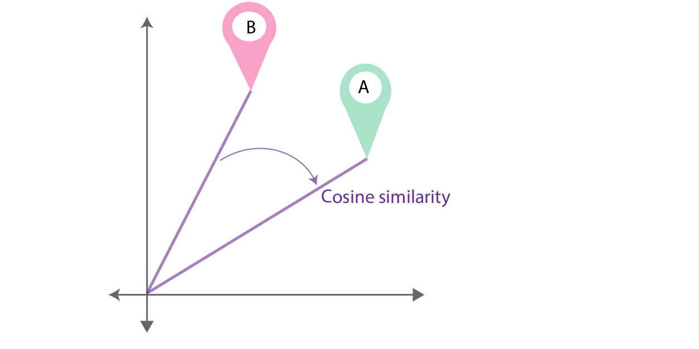


* **String Similarity Metrics**:
    * measures based on characters:
        * for persons, names and addresses. e.g. Levenshtein edit distance, Jaro, etc.
        * for names, you should preferably use a combination of both characters and token levels.
    * characters n-grams:
        * e.g. cosine, Jaccard, etc.
* **Clustering** vs **Blocking**:
    * Clustering: groups with same variability - in ML
    * Blocking (record linkage): grouping to reduce variability - in Stats
* **Metric space** vs **Vector space**:
    * Metric space: Set with a distance concept. The most familiar metric space
      is [3-dimensional Euclidean space](https://en.wikipedia.org/wiki/Three-dimensional_space#3D_EUCLIDEAN_SPACE).
    * Vector space: generally no distance concept, Normed linear vector spaces may have distance functions.
      `d(x,y) = ||x - y||`
* Common steps for **pre-processing** a new dataset:
    * Figure out the dimensions and shapes of the problem `m_train`, `m_test`, `num_px`, ...
    * Reshape the datasets such that each example is now a vector of size `(num_px * num_px * 3, 1)`
    * "Standardize" the data

## 🔵 Deep Learning

* General methodology
    1. Initialize parameters / Define hyperparameters
    2. Loop for num_iterations:
       a. Forward propagation b. Compute cost function c. Backward propagation d. Update parameters (using parameters,
       and grads from backprop)
    3. Use trained parameters to predict labels

* Neural Networks in a snapshot:

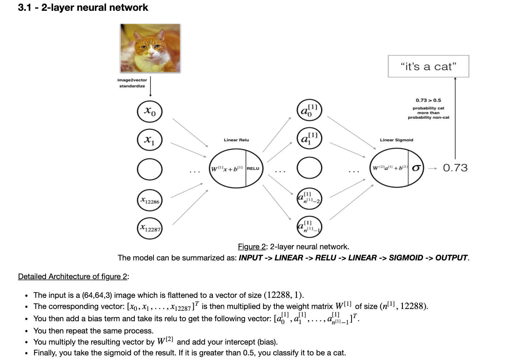
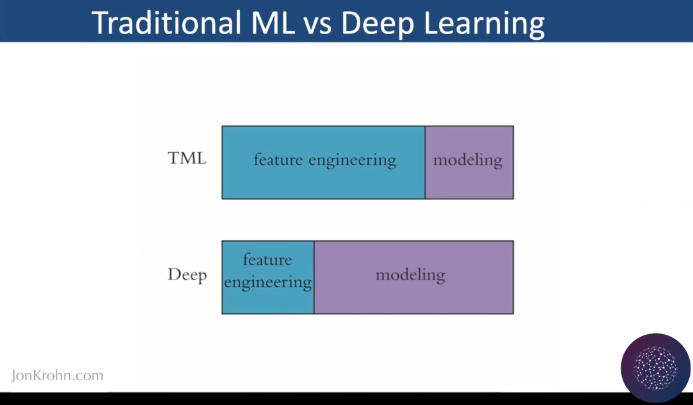

## 🔵 NLP

* Terminologies
    * Text Processing
    * Text Wrangling = Pre-processing = normalization = Standardization
* Google flowchart for any **Text classification**:

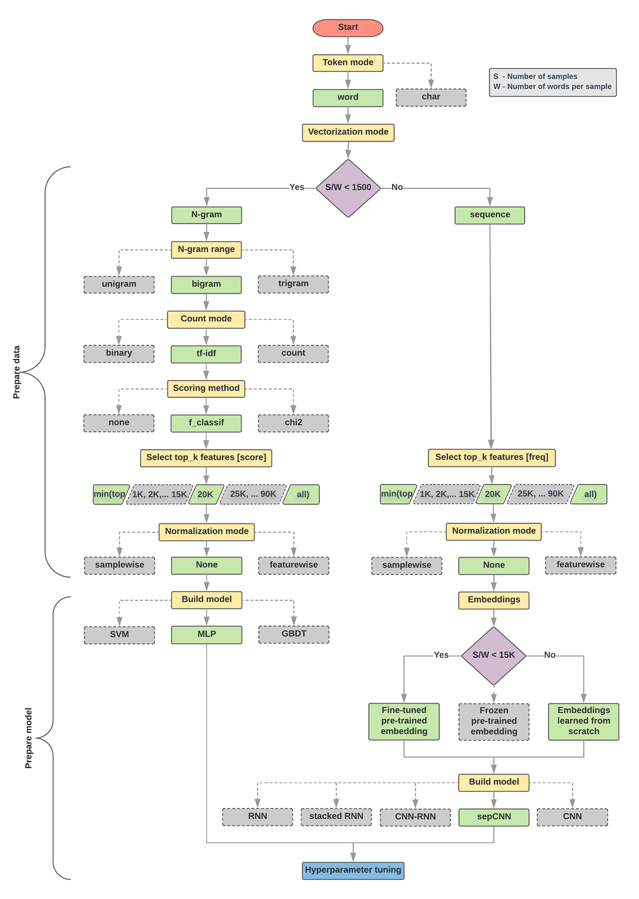

* **Stemming** vs. **Lemmatization**:
    * similarity: both generate the root form of the inflected words.
    * difference: stem might not be an actual word whereas, lemma is an actual language word.

### Pre-processing

* Tokenization
* Removing stop-words
* Removing unnecessary tokens e.g. **special chars**, accented chars, HTML tags
    * Accented chars:
      ```python
      import unicodedata
      unicode.normalize('NFKD', TEXT).encode('ascii', 'ignore').decode('utf-8', 'ignore')
      ```
    * Special chars, by RegExp:
      ```python
      re.sub(pattern=r'[^a-zA-Z0-9\s]', repl='', string=TEXT)
      ```
* Expanding contractions
    * by RegExp
* Case conversion
    * `TEXT.lower()`, `TEXT.upper()`, `TEXT.title()`
* Correcting spelling errors
* Stemming
* Lemmatization (refer to Stemming vs Lemmatization)
* Tagging
* Chunking
* Parsing
* Noise removal

### RegEx Patterns

* word tokens
  ```python
  TOKEN_PATTERN = re.compile('(?u)\\b\\w+\\b')
  TOKENS = TOKEN_PATTERN.findall(TEXT)
  ```
* replace punctuations with whitespace
  ```python
  TEXT = re.sub(r"[^\w\s]", " ", text)
  ```

### Word Embedding

* Convert entire corpus to lowercase
* Remove single quote (‘)
* Careful substitution of sentence boundary punctuations:
    * $123.46
    * end of sentence ? ! .
* Edit Distance: edit distance is a way of quantifying how dissimilar two string are to one another by counting the
  minimum number of operations required to transform one string into the other:
    * The [Levenshtein distance](https://en.wikipedia.org/wiki/Levenshtein_distance) allows deletion, insertion and
      substitution.
    * The [Hamming distance](https://en.wikipedia.org/wiki/Hamming_distance) allows only substitution, hence, **it only
      applies to strings of the same length.**
* **Skip-gram** vs **CBOW**  (Continuous Bag of Words) architecture:
    * **Skip-gram** (rare words, slower): works well with small amount of the training data, represents well even rare
      words or phrases.
    * **CBOW** (frequent words, faster): several times faster to train than the skip-gram, slightly better accuracy for
      the frequent words


* **[Google recommendation](https://developers.google.com/machine-learning/guides/text-classification/step-2-5)**:
  threshold to use Bag-of-Words or more sophisticated vectorizing methods:
  "Referencing Google’s research on text classification
  tasks, [Michael Swarbrick] [Jones recommended](https://www.youtube.com/watch?v=Swx7_bU6GSg&t=1384s) a bag of words
  approach when the ratio of [number of] documents to words per document is less than 1,500":
  ```python
  len(DF) / (len(WORDS) / len(DF)) < 1500
  ```

## 🔵 Transformers

* Types:
    * Causal, Unidirectional, Auto-regressive language models: GPT/GPT-2/GPT-3, CTRL(Salesforce)
    * Masked, Bidirectional, Auto-encoding language models: BERT
    * Permutation (an autoregressive method to learn bidirectional contexts) language models: XLNet
* **GPT-2**:
    * [architecture](https://huggingface.co/models) hyperparameters

  | Name | Parameters | Layers | Hidden | Heads |
                | :--- | :--- | :--- | :--- | :--- |
  | gpt2 | 117Mi(124M) | 12 | 768 | 12 |
  | gpt2-medium | 345Mi(355M) | 24 | 1024 | 16 |
  | gpt2-large | 762Mi(774M) | 36 | 1280 | 20 |
  | gpt2-xl | 1,542Mi(1,558M) | 48 | 1600 | 25 |

    * Vocabulary:
        * size: 50257
        * vector size: 768 (small)
    * dataset WebText:
        * 40 GB text
        * crawl of all outbound links from Reddit with min 3 karma points.
        * 45 million links
        * 8 million documents
        * not published, OpenAI’s internal dataset
* **GPT-3**:
    * 175,000M parameters
    * 570 GB text ~ 400B tokens

### BERT

* Features:
    * convert straight to text
    * concatenate features
    * features separated by [SEP]
    * a natural language context can be given by putting feature values in context of a sentence.

#### Hyperparameters

```python
# training:
epochs = 4
batch_size = 128

# vector-space embedding:
n_dim = 64
n_unique_words = 5000 # as per Maas et al. (2011); may not be optimal
n_words_to_skip = 50 # ditto
max_review_length = 100
pad_type = trunc_type = 'pre'

# neural network architecture:
n_dense = 64
dropout = 0.5
```

* Sensitivity of models to hyperparameters
  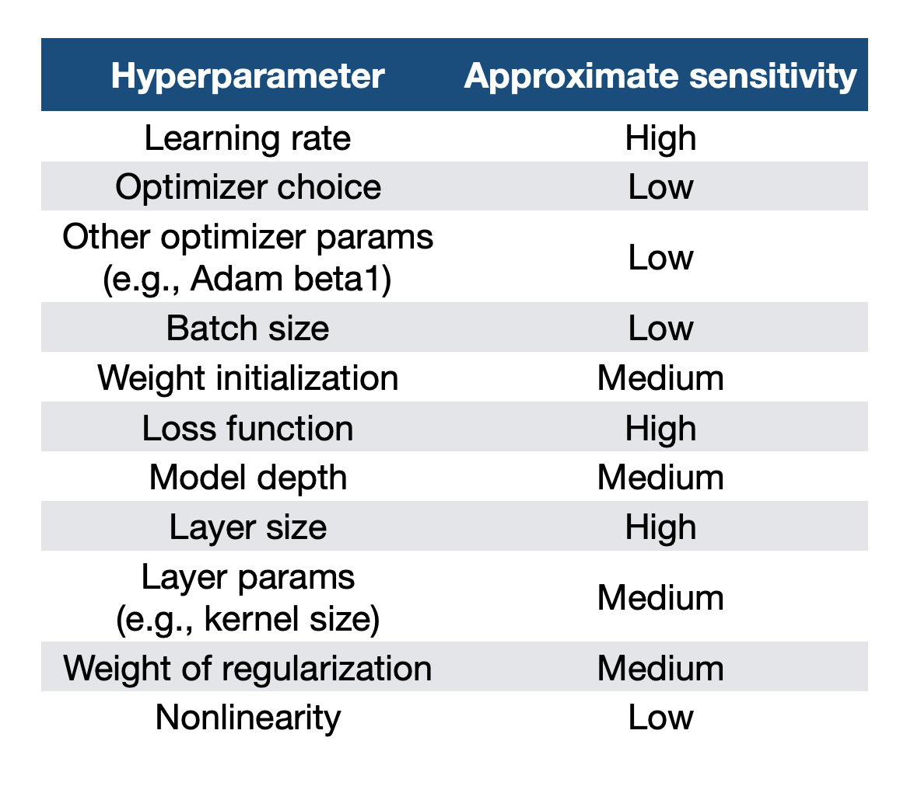

## 🔵 Clustering

* comparison of different clustering algorithms in terms of dataset size:
  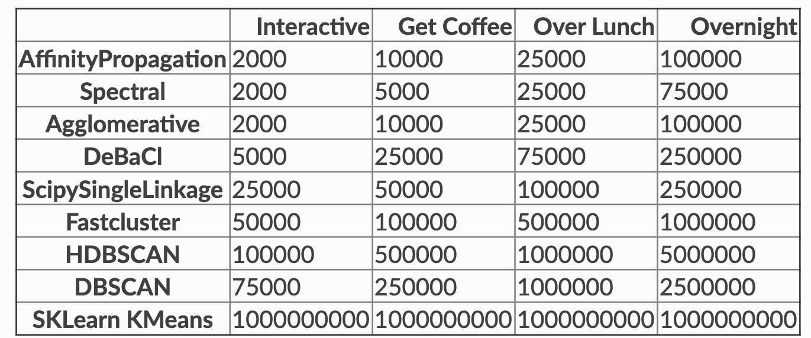
* K-means vs Hierarchical vs Density-based CLUSTERING:
    * K-means : pre-specify the number of clusters K. In practice, the **k-means** algorithm is very fast (one of the
      fastest clustering algorithms available), but it falls in local minima. That’s why it can be useful to restart it
      several times.
    * Hierarchical: no requirement for a pre-specified choice of K
        * Agglomerative or bottom-up
        * Divisive or top-down
    * Hierarchical Clustering Linkage methods:
        * the best –most likely– is the Ward algorithm which mimics all and K-means
          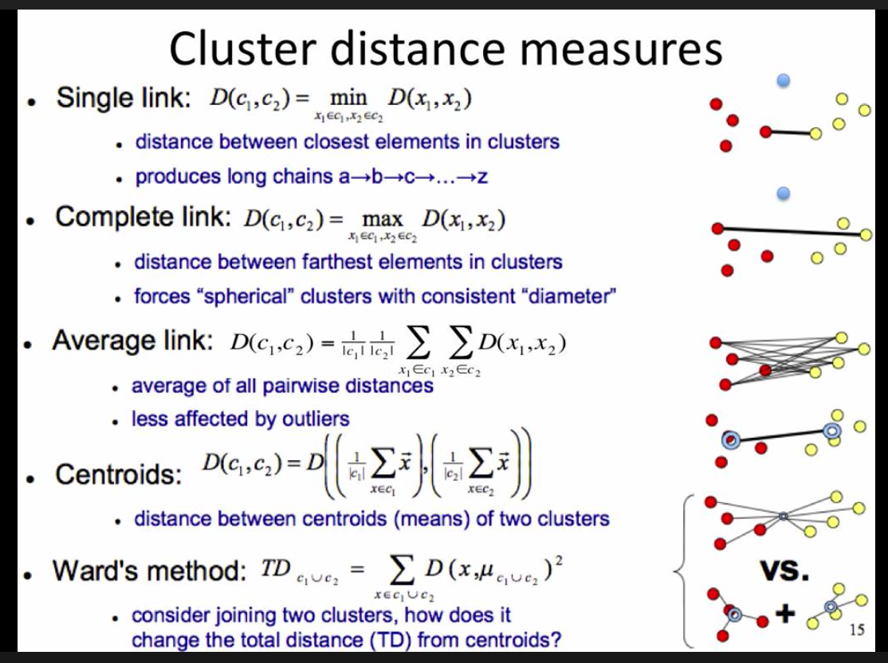

* review [clustering algorithms](https://sites.cs.ucsb.edu/~veronika/MAE_LargeScaleClustering_strnadova.pdf)

## 🔵 📈 Regression

* Regression assumes that the parameters used are independent from one another.

## 🔵 🛠 Feature Engineering

* **Duplicates**:
    1. Duplicated observations? Delete the dupes.
    2. Unique observations with duplicated feature values? Says something about the data, keep them.
* **Missing data**:
    * Delete feature:
      We'll consider that when more than 15% of the data is missing, we should delete the corresponding variable and
      pretend it never existed. This means that we will not try any trick to fill the missing data in these cases.
    * Delete data point:
      Small number of data points with missing data will be deleted.
* **Correlation**:
    * Regression assumes features are independent (not correlated). In Heatmap there should be no significant
      positive/negative relationship between features (off-diagonal cells).
* **Nulls**:
  ```python
    DF.isnull().any()
  ```
* **Outliers** (In case of high kurtosis, skewness, SD, etc):
    * Univariate analysis: identifying by Standardization (zero mean, unit variance (SD)) using (formula is X-u / SD):
      ```python
      sklearn.preprocessing.StandardScaler().fit_transform(df[COL][:, np.newaxis])
      ```
    * Over 95th percentile:
      ```python
      pandas.Series.percentile()
      ```
* **Standardization**:
    * comparable distributions: to be able to compare different distributions with each other.
      sklearn.preprocessing.StandardScaler().fit_transform(df[COL][:, np.newaxis])
* **Categorical Features** (Refer to the same name section in Scikit-learn Saffrons):
    * Nominal features:
        * OneHot
        * Hashing
        * LeaveOneOut
        * Target
    * Ordinal features:
        * Ordinal (Integer)
        * Binary
        * OneHot
        * LeaveOneOut
        * Target
    * Heads-ups:
        - High-cardinal features (e.g. item ID) should be encoded with sklearn.feature_extraction.FeatureHasher
        - Avoid OneHot for high cardinality columns and decision tree-based algorithms
        - Helmert, Sum, BackwardDifference and Polynomial are less likely to be helpful, but if you have time or
          theoretic reason you might want to try them.
        - For regression tasks, Target and LeaveOneOut probably won’t work well.
* ✅ Great Idea: Convert multi-class features to pairwise binary:

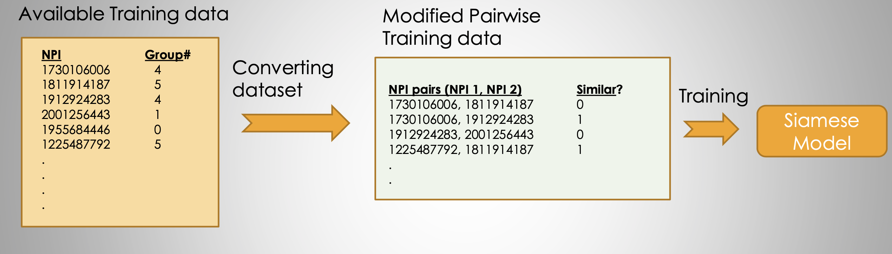

### Data Modalities

* GPS Coordinate precisions:

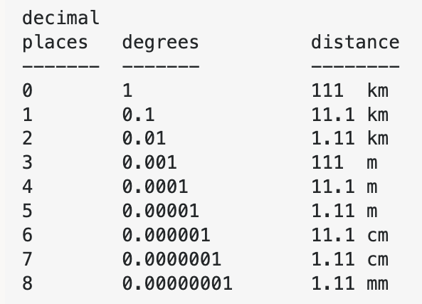

* Floating points format types IEEE:


* 6 different types of AI roles:

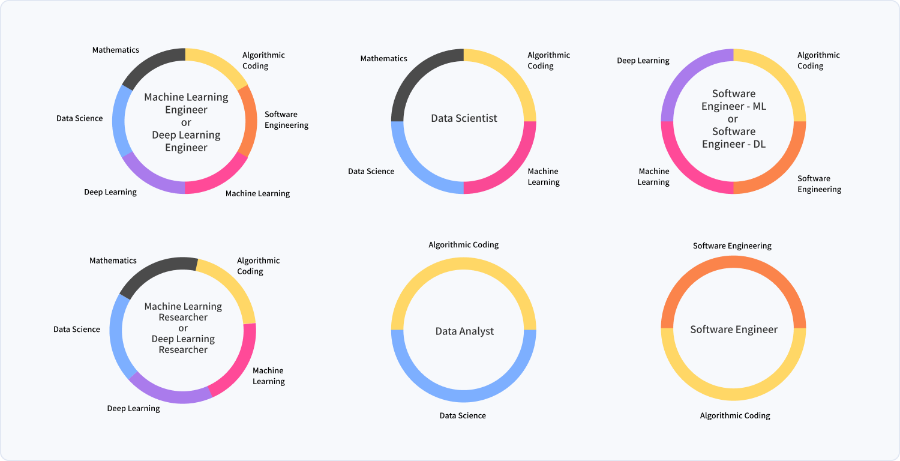

* Logistic Regression is actually a very simple Neural Network:


* Neural network blocks:


* Dimensionality of Neural network weights, biases, Linear functions, and activation functions of each layer
    * size of input X is  (12288,209) (with m=209 examples)

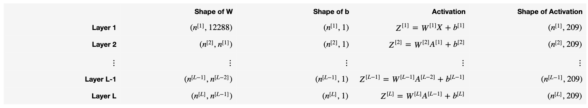

* Predicted value is the activation function value of the last layer, L
